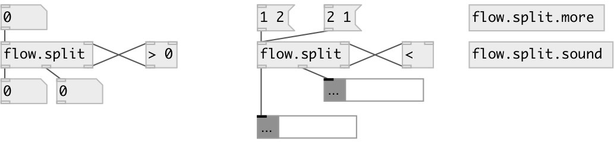

[index](index.html) :: [flow](category_flow.html)
---

# flow.split
**aliases:** [ceammc/split], [split]

###### split data flow by external side-chain predicate

*available since version:* 0.3

---

## information
Predicate side chain should accept value and return 1 (true) or 0 (false). If true, input value is outputed to first outlet. Otherwise to second outlet.

## inlets:

* input value 
_type:_ control
* input from predicate side chain. If 1 received - output for first outlet. If 0 - to second. 
_type:_ control

## outlets:

* values for which predicate side-chain returned true 
_type:_ control
* values for which predicate side-chain returned false 
_type:_ control
* value to predicate side-chain 
_type:_ control

## keywords:

[pass](keywords/pass.html)
[functional](keywords/functional.html)

**See also:**
[\[flow.pass\]](flow.pass.html)
[\[flow.reject\]](flow.reject.html)

**Authors:** Serge Poltavsky

**License:** GPL3 or later

