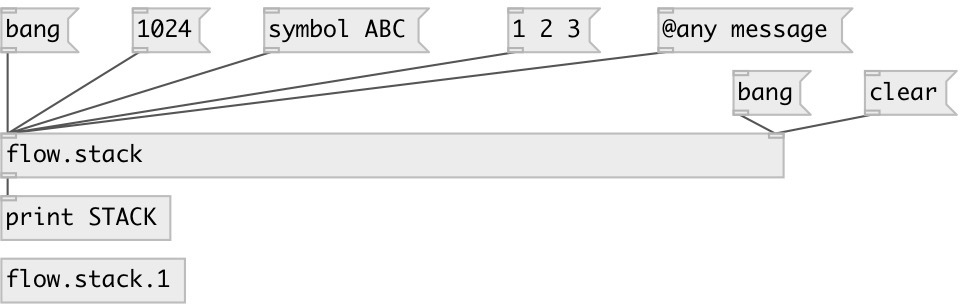

[index](index.html) :: [flow](category_flow.html)
---

# flow.stack

###### any message stack

*available since version:* 0.9.1

---

## arguments:

* **N**
max stack size 
_type:_ int 

## properties:

* **@max_size** 
Get/set maximum stack grow size 
_type:_ int 
_min value:_ 1 
_default:_ 100 

* **@size** (readonly)
Get current number of elements in stack 
_type:_ int 
_default:_ 0 

* **@empty** (readonly)
Get if stack is empty 
_type:_ int 
_enum:_ 0, 1 
_default:_ 1 

* **@on_empty** 
Get/set message send to destination address when stack becomes empty. First list
element is address to send, other additional elements treated as message or
bang if not specified. 
_type:_ list 

* **@on_full** 
Get/set message send to destination address when stack becomes full. First list element
is address to send, other additional elements treated as message or bang if not
specified. 
_type:_ list 

## inlets:

* input: push to stack 
_type:_ control
* output and remove top element 
_type:_ control

## outlets:

* output 
_type:_ control

## keywords:

[stack](keywords/stack.html)

**Authors:** Serge Poltavsky

**License:** GPL3 or later

