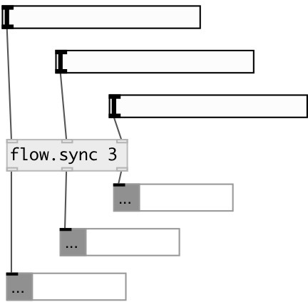

[index](index.html) :: [flow](category_flow.html)
---

# flow.sync

###### bus with only hot inlets

*available since version:* 0.1

---

## information
Sync data flow. All inlets are &#39;hot&#39;. When float, symbol or list arrives to inlet,
            it&#39;s value stored. Then output all stored values from all inlets from rightmost to
            leftmost

## arguments:

* **N**
Number of input/outputs 
__type:__ int 

## inlets:

* first inlet 
__type:__ control 
* ... 
__type:__ control 
* Nth inlet 
__type:__ control 

## outlets:

* first outlet
__type:__ control 
* ... outlet
__type:__ control 
* Nth outlet
__type:__ control 

## keywords:

[flow](keywords/flow.html)
[control](keywords/control.html)

**See also:**
[\[flow.pack&#39;\]](flow.pack%27.html)

**Authors:** Serge Poltavsky

**License:** GPL3 or later

