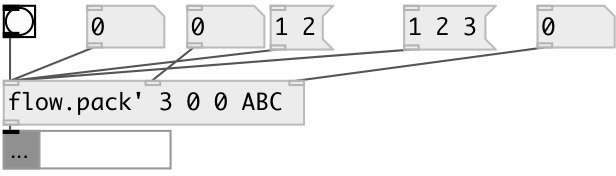

[index](index.html) :: [flow](category_flow.html)
---

# flow.sync_pack

###### flow pack with all hot inlets

*available since version:* 0.8

---

## arguments:

* **N**
number of inputs 
__type:__ int 

* **VALS**
default values for all inlets. If not enough default values given it sets to 0 
__type:__ list 

## properties:

* **@n** 
Get/set number of inlets 
__type:__ int 
__range:__ 1..255 
__default:__ 1 

* **@init** 
Get/set default init values 
__type:__ list 

## inlets:

* output current value 
__type:__ control 
* output current value 
__type:__ control 
* output current value and output 
__type:__ control 

## outlets:

* packed list or message (if message input)
__type:__ control 

## keywords:

[flow](keywords/flow.html)
[pack](keywords/pack.html)
[hot](keywords/hot.html)

**See also:**
[\[pack\]](pack.html)
[\[flow.pack\]](flow.pack.html)

**Authors:** Serge Poltavsky

**License:** GPL3 or later

