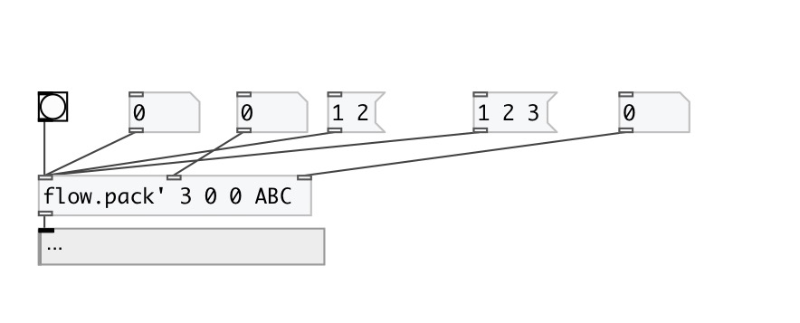
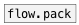

[< reference home](index.html)
---

# flow.sync_pack

flow pack with all hot inlets

---

 

---

---
arguments:

N: number of inputs 
VALS: default values for all inlets. If not enough default
            values given it sets to 0 

---
properties:

---
see also: 

