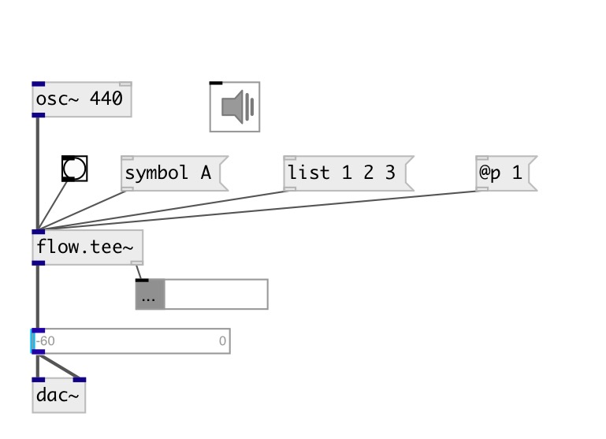

[index](index.html) :: [flow](category_flow.html)
---

# flow.tee~
**aliases:** [ceammc/tee~], [tee~], [ceammc/~-&gt;], [~-&gt;]

###### separate audio and control streams

*available since version:* 0.4

---

## inlets:

* mixed stream 
_type:_ audio

## outlets:

* audio stream 
_type:_ audio
* control stream 
_type:_ control

## keywords:

[flow](keywords/flow.html)
[tee](keywords/tee.html)
[separate](keywords/separate.html)

**Authors:** Serge Poltavsky

**License:** GPL3 or later

