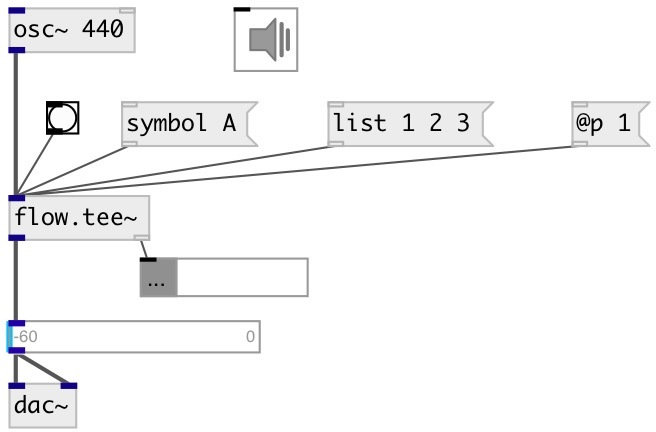

[index](index.html) :: [flow](category_flow.html)
---

# flow.tee~

###### separate audio and control streams

*available since version:* 0.4

---

## inlets:

* mixed stream 
__type:__ audio 

## outlets:

* audio stream
__type:__ audio 
* control stream
__type:__ control 

## keywords:

[flow](keywords/flow.html)
[tee](keywords/tee.html)
[separate](keywords/separate.html)

**Authors:** Serge Poltavsky

**License:** GPL3 or later

