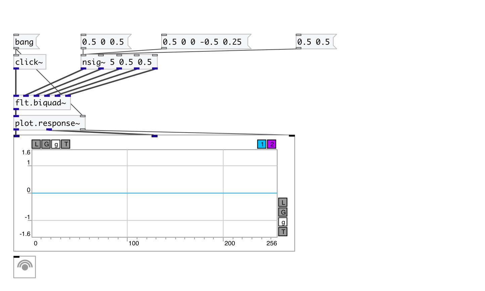

[< reference home](index.html)
---

# flt.biquad~

second order IIR filter.

---

Digital biquad filter is a second-order recursive linear filter, containing two
            poles and two zeros.
transfer function: H(z)=(b0 + b1*z⁻¹ + b2*z⁻²)/(1 + a1*z⁻¹ + a2*z⁻²)
 

---

---
arguments:

---
properties:

---
see also: 

