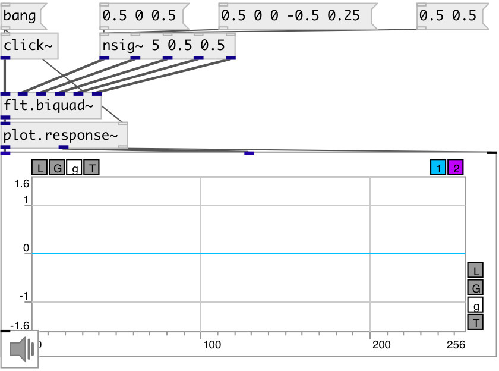

[index](index.html) :: [flt](category_flt.html)
---

# flt.biquad~

###### second order IIR filter.

*available since version:* 0.1

---

## information
Digital biquad filter is a second-order recursive linear filter, containing two poles and two zeros. transfer function: H(z)=(b0 + b1*z⁻¹ + b2*z⁻²)/(1 + a1*z⁻¹ + a2*z⁻²)

## methods:

* **reset**
reset filter state 

## properties:

* **@active** 
Get/set on/off dsp processing 
_type:_ int 
_enum:_ 0, 1 
_default:_ 1 

## inlets:

* input signal 
_type:_ audio
* b0 
_type:_ audio
* b1 
_type:_ audio
* b2 
_type:_ audio
* a1 
_type:_ audio
* a2 
_type:_ audio

## outlets:

* filtered signal 
_type:_ audio

## keywords:

[filter](keywords/filter.html)
[biquad](keywords/biquad.html)

**See also:**
[\[flt.c_bpf~\]](flt.c_bpf~.html)
[\[flt.c_hpf~\]](flt.c_hpf~.html)

**Authors:** Alex Nadzharov, Serge Poltavsky

**License:** GPL3 or later

