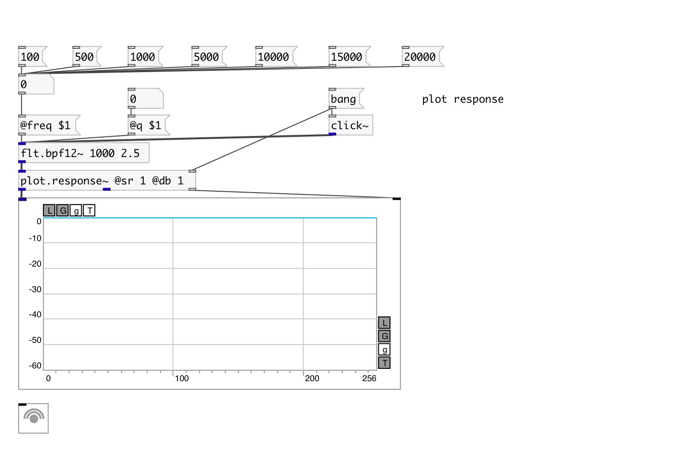
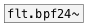

[< reference home](index.html)
---

# flt.bpf12~

Two pole band-pass butterworth filter

---

Band-pass filter passes frequencies within a certain range and rejects frequencies
            outside that range.
Butterworth filter is a type of filter designed to have a frequency response as
            flat as possible in the passband.
 

---

---
arguments:

freq(Hz): center
            frequency 
q: quality factory:
            @freq/BANDWIDTH 

---
properties:

@freq(Hz): center frequency 
@q: quality
            factor: @freq/BANDWIDTH 
@active: on/off dsp
            processing 

---
see also: 

