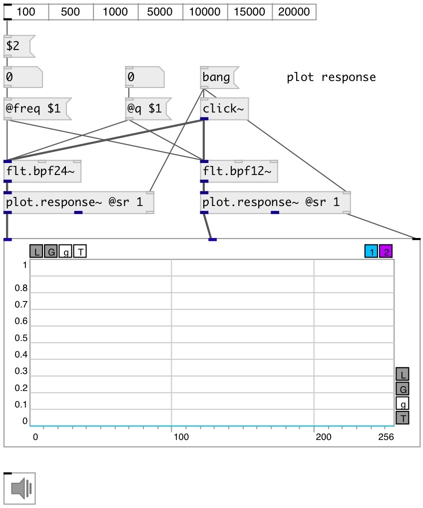

[index](index.html) :: [flt](category_flt.html)
---

# flt.bpf24~

###### Four pole band-pass butterworth filter

*available since version:* 0.1

---

## information
Band-pass filter passes frequencies within a certain range and rejects frequencies
            outside that range.
Butterworth filter is a type of filter designed to have a frequency response as
            flat as possible in the passband.

## arguments:

* **freq**
center frequency 
__type:__ float 
__units:__ Hz 

* **q**
quality factory: @freq/BANDWIDTH 
__type:__ float 

* **ID**
object ID for OSC control 
__type:__ symbol 

## methods:

* **reset**
reset filter state 

## properties:

* **@freq** 
Get/set cutoff frequency 
__type:__ float 
__units:__ Hz 
__range:__ 20..20000 
__default:__ 1000 

* **@q** 
Get/set quality factor: @freq/BANDWIDTH 
__type:__ float 
__range:__ 0.01..100 
__default:__ 2 

* **@active** 
Get/set on/off dsp processing 
__type:__ int 
__enum:__ 0, 1 
__default:__ 1 

## inlets:

* input signal 
__type:__ audio 

## outlets:

* filtered signal
__type:__ audio 

## keywords:

[filter](keywords/filter.html)
[biquad](keywords/biquad.html)
[bpf](keywords/bpf.html)

**See also:**
[\[flt.bpf12~\]](flt.bpf12~.html)

**Authors:** Alex Nadzharov, Serge Poltavsky

**License:** GPL3 or later

