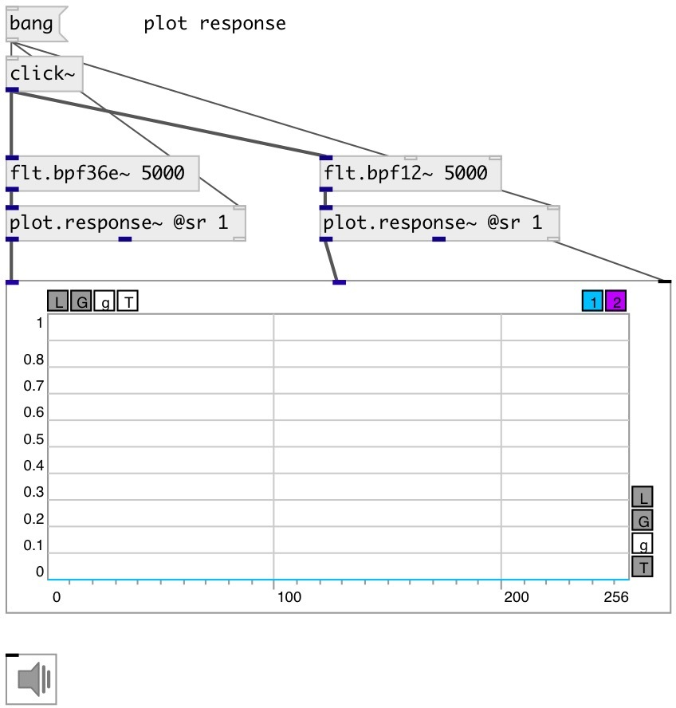

[index](index.html) :: [flt](category_flt.html)
---

# flt.bpf36e~

###### elliptic band-pass filter with -36db rolloff

*available since version:* 0.9.7

---

## information
Band-pass filter passes frequencies within a certain range and rejects frequencies outside that range.

## arguments:

* **FREQ**
center frequency 
_type:_ float 
_units:_ Hz 

* **Q**
quality factory: @freq/BANDWIDTH 
_type:_ float 

## methods:

* **reset**
reset filter state 

## properties:

* **@freq** (initonly)
Get/set cutoff frequency 
_type:_ float 
_units:_ Hz 
_range:_ 20..20000 
_default:_ 1000 

* **@q** (initonly)
Get/set quality factor: @freq/BANDWIDTH 
_type:_ float 
_range:_ 0.25..32 
_default:_ 2 

* **@active** 
Get/set on/off dsp processing 
_type:_ bool 
_default:_ 1 

* **@osc** (initonly)
Get/set OSC server name to listen 
_type:_ symbol 

* **@id** (initonly)
Get/set OSC address id. If specified, bind all properties to /ID/flt_bpf36e/PROP_NAME
osc address, if empty bind to /flt_bpf36e/PROP_NAME. 
_type:_ symbol 

## inlets:

* input signal 
_type:_ audio

## outlets:

* filtered signal 
_type:_ audio

## keywords:

[filter](keywords/filter.html)
[elliptic](keywords/elliptic.html)
[bpf](keywords/bpf.html)

**See also:**
[\[flt.bpf72e~\]](flt.bpf72e~.html)
[\[flt.bpf24~\]](flt.bpf24~.html)

**Authors:** Serge Poltavsky

**License:** GPL3 or later

