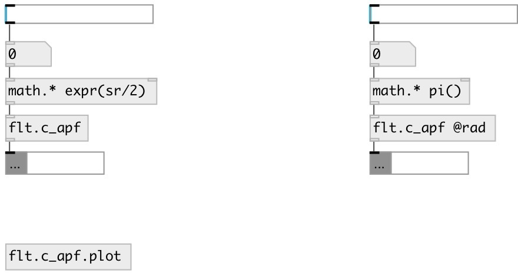

[index](index.html) :: [flt](category_flt.html)
---

# flt.c_apf

###### Allpass filter coefficient calculator for biquad

*available since version:* 0.9.2

---

## information
Allpass filter is a signal processing filter that passes all frequencies equally in gain, but changes the phase relationship among various frequencies. Most types of filter reduce the amplitude (i.e. the magnitude) of the signal applied to it for some values of frequency, whereas the all-pass filter allows all frequencies through without changes in level. Calculates coefficients for transfer function: H(z)=(b0 + b1*z⁻¹ + b2*z⁻²)/(1 + a1*z⁻¹ + a2*z⁻²)

## arguments:

* **freq**
center frequency 
_type:_ float 
_units:_ Hz 

## methods:

* **bw**
set bandwidth in octaves 
  __parameters:__
  - **OCT** bandwidth 
    type: float  
    required: True  

## properties:

* **@freq** 
Get/set center frequency 
_type:_ float 
_units:_ Hz 
_range:_ 0..22050 
_default:_ 0 

* **@q** 
Get/set quality factor: @freq/BANDWIDTH 
_type:_ float 
_range:_ 0.01..100 
_default:_ 0.707107 

* **@rad** 
Get/set use angular frequency 
_type:_ flag 

## inlets:

* filter frequency 
_type:_ control

## outlets:

* list: b0 b1 b2 a1 a2 
_type:_ control

## keywords:

[filter](keywords/filter.html)
[biquad](keywords/biquad.html)
[hpf](keywords/hpf.html)
[allpass](keywords/allpass.html)

**See also:**
[\[flt.c_lpf\]](flt.c_lpf.html)
[\[hilbert~\]](hilbert~.html)

**Authors:** Serge Poltavsky

**License:** GPL3 or later

