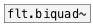
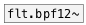
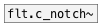

[< reference home](ceammc_lib.html)
---

# flt.c_bpf~


BPF coefficient calculator for biquad filter

---

Calculates coefficients for transfer function: H(z)=(b0 + b1*z⁻¹ + b2*z⁻²)/(1 +
            a1*z⁻¹ + a2*z⁻²)
<br>


---


```


[noise.pink~] [T] [F]        [F]
|        .____/   |          |
[*~      ]        [@freq $1( [@q $1(
|                 |          |
|                 [flt.c_bpf~ 1000 100]
|                 | ^| ^^| ^^^| ^^^^|
|                 |  |   |    |     |
|                 |  |   |    |     |
|                 |. |.. |... |.... |.....
[flt.biquad~                              ]
|
[ui.gain~ @size 120 16]
|\
[dac~]

[ui.dsp~]

            
```

---
arguments:

freq(Hz): center
            frequency<br>
q: quality
            factory<br>

---
properties:

@freq(Hz): center frequency<br>
@q: quality
            factor: @freq/BANDWIDTH<br>
@active: on/off dsp
            processing<br>

---
see also:<br>
[](flt.biquad~.html)
[](flt.bpf12~.html)
[](flt.c_notch~.html)
