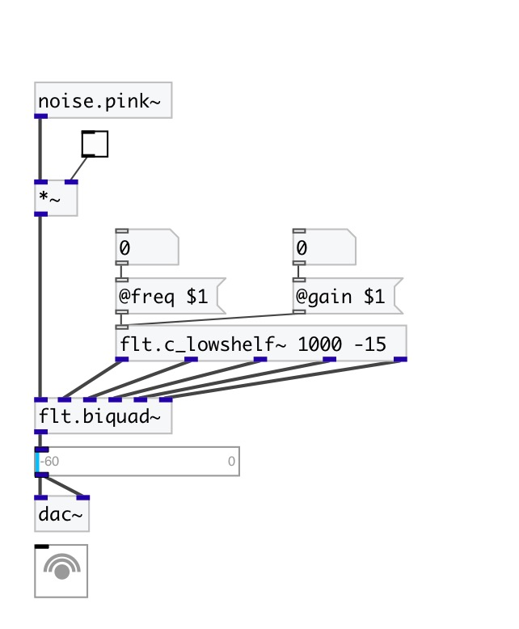

[< reference home](index.html)
---

# flt.c_lowshelf~

Lowshelf filter coefficient calculator for biquad

---

gain boost|cut below some frequency
Calculates coefficients for transfer function: H(z)=(b0 + b1*z⁻¹ + b2*z⁻²)/(1 +
            a1*z⁻¹ + a2*z⁻²)
 

---

---
arguments:

freq(Hz): cutoff frequency 
gain(db): filter
            gain 

---
properties:

@freq(Hz): center frequency 
@gain(db): filter gain 
@active: on/off dsp
            processing 

---
see also: 

