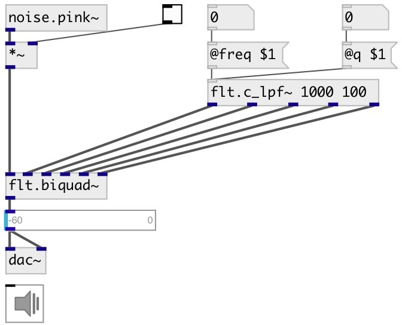

[index](index.html) :: [flt](category_flt.html)
---

# flt.c_lpf~

###### LPF coefficient calculator for biquad filter

*available since version:* 0.1

---

## information
Calculates coefficients for transfer function: H(z)=(b0 + b1*z⁻¹ + b2*z⁻²)/(1 +
            a1*z⁻¹ + a2*z⁻²)

## arguments:

* **freq**
center frequency 
__type:__ float 
__units:__ Hz 

* **q**
quality factory 
__type:__ float 

## properties:

* **@freq** 
Get/set center frequency 
__type:__ float 
__units:__ Hz 
__range:__ 20..20000 
__default:__ 1000 

* **@q** 
Get/set quality factor: @freq/BANDWIDTH 
__type:__ float 
__range:__ 0.01..100 
__default:__ 1 

* **@active** 
Get/set on/off dsp processing 
__type:__ int 
__enum:__ 0, 1 
__default:__ 1 

## inlets:

* control signal 
__type:__ control 

## outlets:

* b0
__type:__ audio 
* b1
__type:__ audio 
* b2
__type:__ audio 
* a1
__type:__ audio 
* a2
__type:__ audio 

## keywords:

[filter](keywords/filter.html)
[biquad](keywords/biquad.html)
[lowpass](keywords/lowpass.html)

**See also:**
[\[flt.biquad~\]](flt.biquad~.html)
[\[flt.lpf12~\]](flt.lpf12~.html)

**Authors:** Alex Nadzharov, Serge Poltavsky

**License:** GPL3 or later

