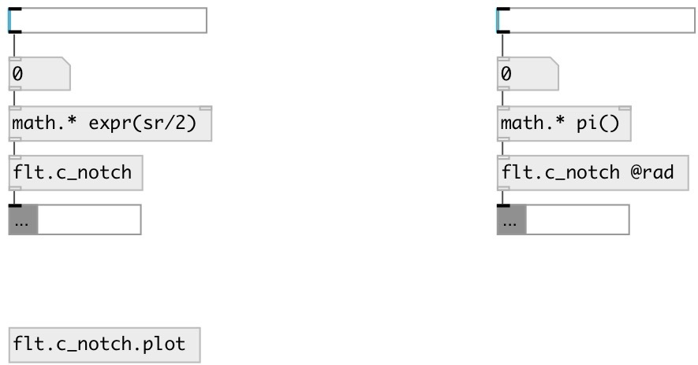

[index](index.html) :: [flt](category_flt.html)
---

# flt.c_notch

###### Notch filter coefficient calculator for biquad

*available since version:* 0.9.2

---

## information
Calculates coefficients for transfer function: H(z)=(b0 + b1*z⁻¹ + b2*z⁻²)/(1 + a1*z⁻¹ + a2*z⁻²)

## arguments:

* **freq**
center frequency 
_type:_ float 
_units:_ Hz 

## methods:

* **bw**
set bandwidth in octaves 
  __parameters:__
  - **OCT** bandwidth 
    type: float  
    required: True  

## properties:

* **@freq** 
Get/set center frequency 
_type:_ float 
_units:_ Hz 
_range:_ 20..22050 
_default:_ 1000 

* **@q** 
Get/set quality factor: @freq/BANDWIDTH 
_type:_ float 
_range:_ 0.01..100 
_default:_ 0.707107 

* **@rad** 
Get/set use angular frequency 
_type:_ flag 

## inlets:

* filter frequency 
_type:_ control

## outlets:

* list: b0 b1 b2 a1 a2 
_type:_ control

## keywords:

[filter](keywords/filter.html)
[biquad](keywords/biquad.html)
[notch](keywords/notch.html)
[reject](keywords/reject.html)

**See also:**
[\[flt.c_lpf\]](flt.c_lpf.html)

**Authors:** Serge Poltavsky

**License:** GPL3 or later

