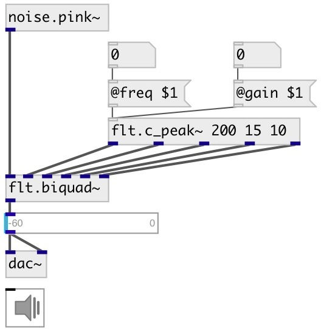

[index](index.html) :: [flt](category_flt.html)
---

# flt.c_peak~

###### Peaking equalizer calculator for biquad

*available since version:* 0.1

---

## information
Calculates coefficients for transfer function: H(z)=(b0 + b1*z⁻¹ + b2*z⁻²)/(1 + a1*z⁻¹ + a2*z⁻²)

## arguments:

* **freq**
center frequency 
_type:_ float 
_units:_ Hz 

* **gain**
filter gain 
_type:_ float 
_units:_ db 

* **q**
quality factory 
_type:_ float 

## properties:

* **@freq** 
Get/set center frequency 
_type:_ float 
_units:_ Hz 
_range:_ 20..20000 
_default:_ 1000 

* **@gain** 
Get/set filter gain 
_type:_ float 
_units:_ db 
_range:_ -15..15 
_default:_ 0 

* **@q** 
Get/set quality factor: @freq/BANDWIDTH 
_type:_ float 
_range:_ 0.01..100 
_default:_ 1 

* **@active** 
Get/set on/off dsp processing 
_type:_ int 
_enum:_ 0, 1 
_default:_ 1 

## inlets:

* control signal 
_type:_ control

## outlets:

* b0 
_type:_ audio
* b1 
_type:_ audio
* b2 
_type:_ audio
* a1 
_type:_ audio
* a2 
_type:_ audio

## keywords:

[filter](keywords/filter.html)
[equalizer](keywords/equalizer.html)

**See also:**
[\[flt.eq_peak~\]](flt.eq_peak~.html)
[\[flt.biquad~\]](flt.biquad~.html)

**Authors:** Alex Nadzharov, Serge Poltavsky

**License:** GPL3 or later

