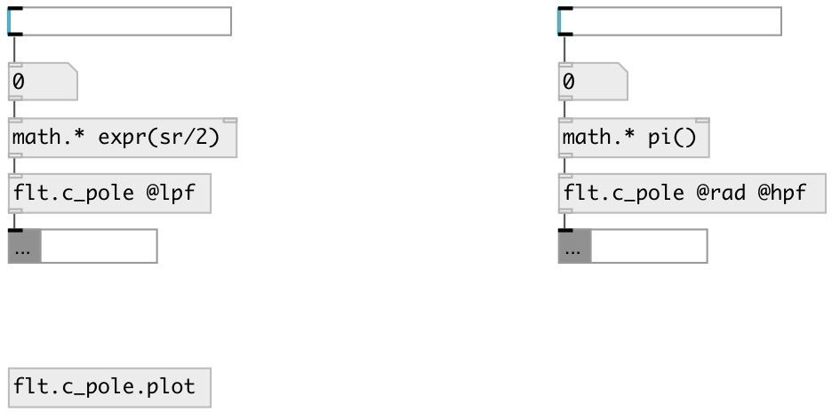

[index](index.html) :: [flt](category_flt.html)
---

# flt.c_pole
**aliases:** [ceammc/pole-&gt;biquad], [pole-&gt;biquad]

###### One-pole coefficient calculator for biquad filter

*available since version:* 0.9.2

---

## information
Calculates coefficients for transfer function: H(z)=(b0 + b1*z⁻¹ + b2*z⁻²)/(1 + a1*z⁻¹ + a2*z⁻²)

## arguments:

* **FREQ**
center frequency 
_type:_ float 
_units:_ Hz 

## properties:

* **@freq** 
Get/set center frequency 
_type:_ float 
_units:_ Hz 
_range:_ 0..22050 
_default:_ 1000 

* **@rad** (initonly)
Get/set use angular frequency 
_type:_ flag 

* **@mode** 
Get/set filter modey 
_type:_ symbol 
_enum:_ hpf, lpf 
_default:_ lpf 

* **@lpf** 
Get/set to @mode lpf 
_type:_ alias 

* **@hpf** 
Get/set ti @mode hpf 
_type:_ alias 

## inlets:

* filter frequency 
_type:_ control

## outlets:

* list: b0 b1 b2 a1 a2 
_type:_ control

## keywords:

[filter](keywords/filter.html)
[biquad](keywords/biquad.html)
[one](keywords/one.html)
[pol](keywords/pol.html)

**See also:**
[\[flt.c_lpf\]](flt.c_lpf.html)

**Authors:** Serge Poltavsky

**License:** GPL3 or later

