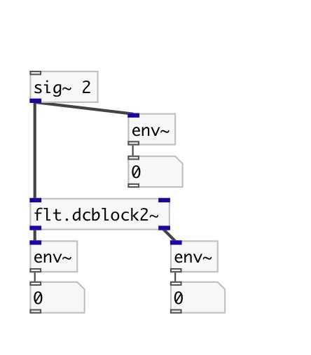

[< reference home](index.html)
---

# flt.dcblock2~

stereo DC blocker

---

Stereo DC blocker. It has -3dB point near 35 Hz (at 44.1 kHz) and high-frequency
            gain near 1.0025 (due to no scaling).
 

---

---
arguments:

---
properties:

---
see also: 

