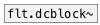

[<<< reference home](ceammc_lib.md)
---

# flt.dcblock2~

```


[sig~ 2]
|    | |
|    | [env~]
|    | |
|    | [F]
|    |
[flt.dcblock2~]
|         ^|
[env~]    [env~]
|         |
[F]       [F]

            
```
---
stereo DC blocker
---
arguments:


---
properties:


---
see also:<br>
[](flt.dcblock~.md)
