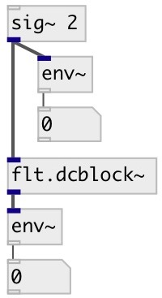

[index](index.html) :: [flt](category_flt.html)
---

# flt.dcblock~

###### mono DC blocker

*available since version:* 0.1

---

## information
Mono DC blocker. It has -3dB point near 35 Hz (at 44.1 kHz) and high-frequency
            gain near 1.0025 (due to no scaling)

## properties:

* **@active** 
Get/set on/off dsp processing 
_type:_ int 
_enum:_ 0, 1 
_default:_ 1 

## inlets:

* input signal 
_type:_ audio

## outlets:

* output signal 
_type:_ audio

## keywords:

[filter](keywords/filter.html)
[dcblock](keywords/dcblock.html)

**See also:**
[\[flt.dcblock2~\]](flt.dcblock2~.html)

**Authors:** Alex Nadzharov, Serge Poltavsky

**License:** GPL3 or later

