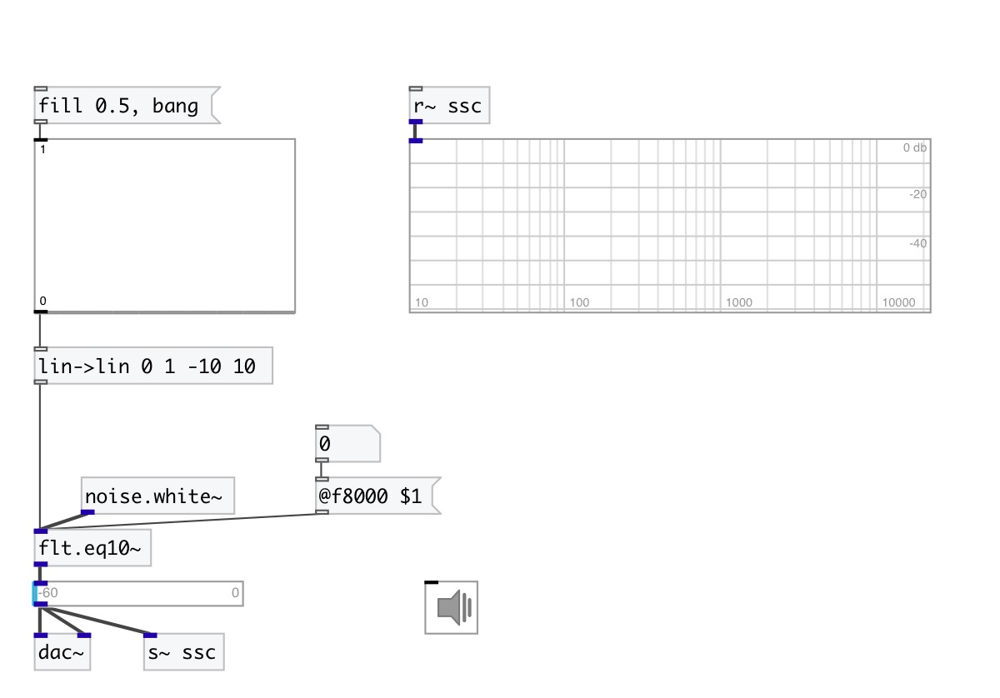

[index](index.html) :: [flt](category_flt.html)
---

# flt.eq10~

###### graphic 10 band equalizer

*available since version:* 0.1

---

## information
One band per octave. 5th-order Butterworth filters

## methods:

* **reset**
reset filter state to default 

## properties:

* **@f31** 
Get/set gain at 31.25Hz 
__type:__ float 
__units:__ db 
__range:__ -70..10 
__default:__ 0 

* **@f62** 
Get/set gain at 62.5Hz 
__type:__ float 
__units:__ db 
__range:__ -70..10 
__default:__ 0 

* **@f125** 
Get/set gain at 125Hz 
__type:__ float 
__units:__ db 
__range:__ -70..10 
__default:__ 0 

* **@f250** 
Get/set gain at 250Hz 
__type:__ float 
__units:__ db 
__range:__ -70..10 
__default:__ 0 

* **@f500** 
Get/set gain at 500Hz 
__type:__ float 
__units:__ db 
__range:__ -70..10 
__default:__ 0 

* **@f1000** 
Get/set gain at 1000Hz 
__type:__ float 
__units:__ db 
__range:__ -70..10 
__default:__ 0 

* **@f2000** 
Get/set gain at 2000Hz 
__type:__ float 
__units:__ db 
__range:__ -70..10 
__default:__ 0 

* **@f4000** 
Get/set gain at 4000Hz 
__type:__ float 
__units:__ db 
__range:__ -70..10 
__default:__ 0 

* **@f8000** 
Get/set gain at 8000Hz 
__type:__ float 
__units:__ db 
__range:__ -70..10 
__default:__ 0 

* **@f16000** 
Get/set gain at 16000Hz 
__type:__ float 
__units:__ db 
__range:__ -70..10 
__default:__ 0 

* **@active** 
Get/set on/off dsp processing 
__type:__ int 
__enum:__ 0, 1 
__default:__ 1 

## inlets:

* input signal 
__type:__ audio 

## outlets:

* output signal
__type:__ audio 

## keywords:

[graphic](keywords/graphic.html)
[filter](keywords/filter.html)
[equalizer](keywords/equalizer.html)

**See also:**
[\[flt.eq_peak~\]](flt.eq_peak~.html)

**Authors:** Serge Poltavsky

**License:** GPL3 or later

