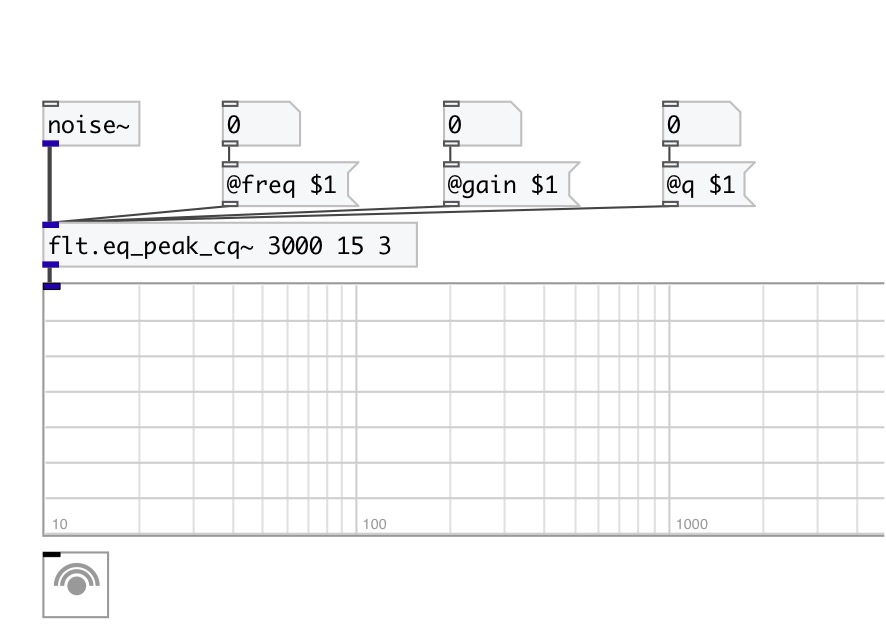

[< reference home](index.html)
---

# flt.eq_peak_cq~

constant-Q second order peaking equalizer section

---

 

---

---
arguments:

freq(Hz): center
            frequency 
gain(db): filter
            gain 
q: quality
            factory 

---
properties:

@freq(Hz): center frequency 
@gain(db): filter gain 
@q: quality
            factor: @freq/BANDWIDTH 
@active: on/off dsp
            processing 

---
see also: 

