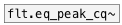
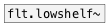

# flt.eq_peak~

```


[noise~] [F]        [F]        [F]
|        |          |          |
|        [@freq $1( [@gain $1( [@bandwidth $1(
|        |          |          |
[flt.eq_peak~ 3000 20 400      ]
|
[ui.ssc~ @size 500 120]


[ui.dsp~]

            
```
---
arguments:

freq(Hz): peak
            frequency<br>
gain(db): level
            at fx (boost if &gt;0 or cut if &lt;0)<br>
bandwidth(Hz): 
            bandwidth of peak<br>

---
properties:

@freq(Hz): peak frequency<br>
@gain(db): level at fx (boost if &gt;0 or cut if &lt;0)<br>
@bandwidth(Hz): bandwidth of peak<br>
@active: on/off dsp
            processing<br>

see also:<br>



