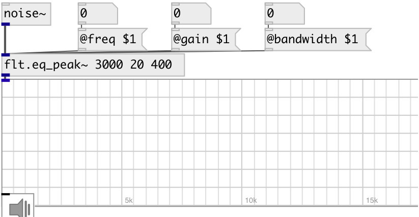

[index](index.html) :: [flt](category_flt.html)
---

# flt.eq_peak~

###### second order &#34;peaking equalizer&#34; section (gain boost or cut near some
            frequency). Also called a &#34;parametric equalizer&#34; section.

*available since version:* 0.1

---

## arguments:

* **freq**
peak frequency 
_type:_ float 
_units:_ Hz 

* **gain**
level at fx (boost if &gt;0 or cut if &lt;0) 
_type:_ float 
_units:_ db 

* **bandwidth**
bandwidth of peak 
_type:_ float 
_units:_ Hz 

## properties:

* **@freq** 
Get/set peak frequency 
_type:_ float 
_units:_ Hz 
_range:_ 20..20000 
_default:_ 1000 

* **@gain** 
Get/set level at fx (boost if &gt;0 or cut if &lt;0) 
_type:_ float 
_units:_ db 
_range:_ -15..15 
_default:_ 0 

* **@bandwidth** 
Get/set bandwidth of peak 
_type:_ float 
_units:_ Hz 
_range:_ 1..5000 
_default:_ 100 

* **@active** 
Get/set on/off dsp processing 
_type:_ int 
_enum:_ 0, 1 
_default:_ 1 

## inlets:

* input signal 
_type:_ audio

## outlets:

* filtered signal 
_type:_ audio

## keywords:

[filter](keywords/filter.html)
[equalizer](keywords/equalizer.html)

**See also:**
[\[flt.eq_peak_cq~\]](flt.eq_peak_cq~.html)
[\[flt.lowshelf~\]](flt.lowshelf~.html)
[\[flt.highshelf~\]](flt.highshelf~.html)

**Authors:** Alex Nadzharov, Serge Poltavsky

**License:** GPL3 or later

