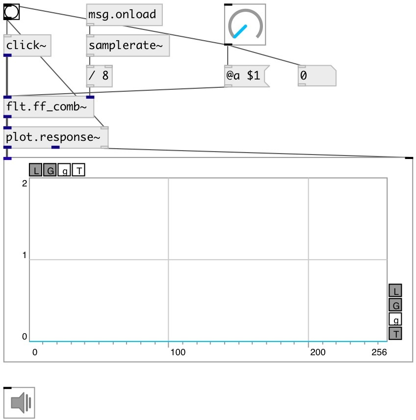

[index](index.html) :: [flt](category_flt.html)
---

# flt.ff_comb~

###### feed forward comb filter

*available since version:* 0.9.1

---

## information
Frequency response of a comb filter consists of a series of regularly spaced notches, giving the appearance of a comb Structure of a feedforward comb filter may be described by the following difference equation: y[n] = x[n] + α[n−K] where K is the delay length (measured in samples), and α is a scaling factor applied to the delayed signal

## arguments:

* **a**
scaling factor of delayed signal 
_type:_ float 

## methods:

* **reset**
reset filter state 

## properties:

* **@a** 
Get/set scaling factor of delayed signal 
_type:_ float 
_range:_ -1..1 
_default:_ 1 

* **@active** 
Get/set on/off dsp processing 
_type:_ int 
_enum:_ 0, 1 
_default:_ 1 

## inlets:

* input signal 
_type:_ audio
* filter notch frequency 
_type:_ audio

## outlets:

* filtered signal 
_type:_ audio

## keywords:

[filter](keywords/filter.html)
[comb](keywords/comb.html)

**See also:**
[\[flt.fb_comb~\]](flt.fb_comb~.html)

**Authors:** Serge Poltavsky

**License:** GPL3 or later

