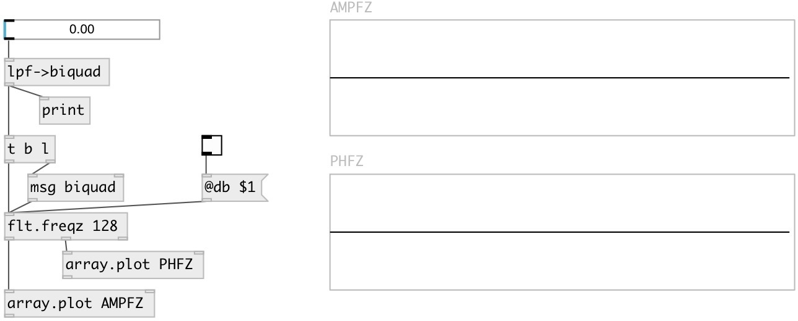

[index](index.html) :: [flt](category_flt.html)
---

# flt.freqz

###### compute the frequency response of a digital filter

*available since version:* 0.9.2

---

## information
Given the M-order numerator b and N-order denominator a of a digital filter,
            compute its frequency response: H(eʲʷ) = B(eʲʷ)/A(eʲʷ) =
            (b⁰+b¹e⁻ʲʷ+...+bᴹe⁻ʲʷᴹ)/(1+a¹e⁻ʲʷ+...+aᴺe⁻ʲʷᴺ)

## arguments:

* **N**
number of points 
__type:__ int 

## methods:

* **biquad**
set &#39;b&#39; and &#39;a&#39; coefficients, no output 
  __parameters:__
  - **b0** b0 
    type: float  
    required: True  

  - **b1** b1 
    type: float  
    required: True  

  - **b2** b2 
    type: float  
    required: True  

  - **a1** a1 
    type: float  
    required: True  

  - **a2** a2 
    type: float  
    required: True  

## properties:

* **@a** 
Get/set denominator (poles) coefficients. &#39;a0&#39; always implicitly set to 1, property
value set a1...an coefficients 
__type:__ list 

* **@b** 
Get/set numerator (zeros) coefficients 
__type:__ list 
__default:__ 1 

* **@n** 
Get/set number of points 
__type:__ int 
__range:__ 4..1024 
__default:__ 256 

* **@db** 
Get/set output amp response in db scale 
__type:__ int 
__enum:__ 0, 1 
__default:__ 0 

## inlets:

* calculate and output frequency responses 
__type:__ control 

## outlets:

* list: amplitude response data
__type:__ control 
* list: phase response data
__type:__ control 
* int: number of points
__type:__ control 

## keywords:

[filter](keywords/filter.html)
[calc](keywords/calc.html)
[bode](keywords/bode.html)
[frequence](keywords/frequence.html)
[response](keywords/response.html)
[phase](keywords/phase.html)
[plot](keywords/plot.html)

**See also:**
[\[flt.freqz~\]](flt.freqz~.html)

**Authors:** Serge Poltavsky

**License:** GPL3 or later

