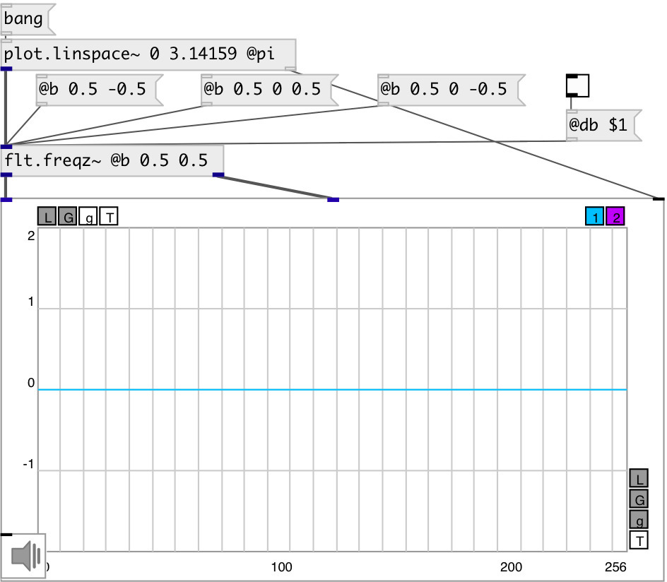

[index](index.html) :: [flt](category_flt.html)
---

# flt.freqz~

###### compute the frequency response of a digital filter

*available since version:* 0.9

---

## information
Given the M-order numerator b and N-order denominator a of a digital filter, compute its frequency response: H(eʲʷ) = B(eʲʷ)/A(eʲʷ) = (b⁰+b¹e⁻ʲʷ+...+bᴹe⁻ʲʷᴹ)/(1+a¹e⁻ʲʷ+...+aᴺe⁻ʲʷᴺ)

## properties:

* **@a** 
Get/set denominator (poles) coefficients. &#39;a0&#39; always implicitly set to 1, property
value set a1...an coefficients 
_type:_ list 

* **@b** 
Get/set numerator (zeros) coefficients 
_type:_ list 
_default:_ 1 

* **@sr** 
Get/set normalize using current samplerate 
_type:_ int 
_enum:_ 0, 1 
_default:_ 0 

* **@db** 
Get/set output amp response in db scale 
_type:_ int 
_enum:_ 0, 1 
_default:_ 0 

## inlets:

* input frequency in radians [0, π] or in hertz [0 sr/2] if @sr property is true 
_type:_ audio

## outlets:

* amplitude frequency response signal 
_type:_ audio
* phase frequency response signal 
_type:_ audio

## keywords:

[filter](keywords/filter.html)
[calc](keywords/calc.html)
[bode](keywords/bode.html)
[frequence](keywords/frequence.html)
[response](keywords/response.html)
[phase](keywords/phase.html)
[plot](keywords/plot.html)

**Authors:** Serge Poltavsky

**License:** GPL3 or later

