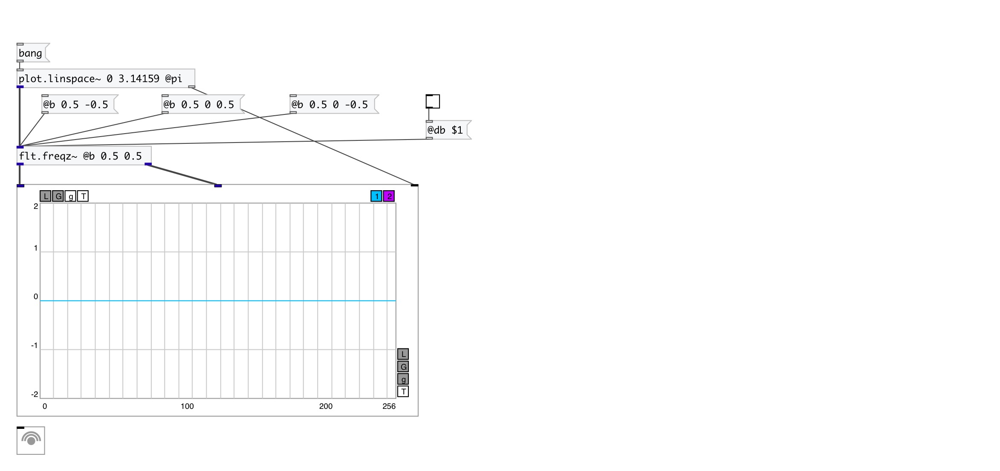

[< reference home](index.html)
---

# flt.freqz~

compute the frequency response of a digital filter

---

Given the M-order numerator b and N-order denominator a of a digital filter,
            compute its frequency response: H(eʲʷ) = B(eʲʷ)/A(eʲʷ) =
            (b⁰+b¹e⁻ʲʷ+...+bᴹe⁻ʲʷᴹ)/(1+a¹e⁻ʲʷ+...+aᴺe⁻ʲʷᴺ)
 

---

---
arguments:

---
properties:

@a: denominator (poles) coefficients. &#39;a0&#39; always
            implicitly set to 1, property value set a1...an coefficients 
@b: numerator (zeros) coefficients 
@sr: normalize using current
            samplerate 

