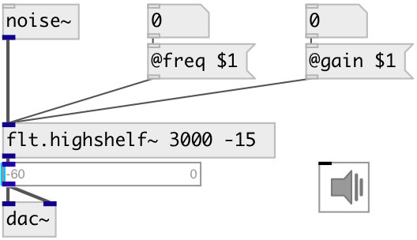

[index](index.html) :: [flt](category_flt.html)
---

# flt.highshelf~

###### gain boost|cut above some frequency

*available since version:* 0.1

---

## arguments:

* **FREQ**
starting frequency for the shelf 
_type:_ float 
_units:_ Hz 

* **GAIN**
amount of boost or cut apply to the signal 
_type:_ float 
_units:_ db 

## properties:

* **@freq** 
Get/set starting frequency for the shelf 
_type:_ float 
_units:_ Hz 
_range:_ 20..20000 
_default:_ 10000 

* **@gain** 
Get/set amount of boost or cut apply to the signal 
_type:_ float 
_units:_ db 
_range:_ -15..15 
_default:_ 0 

* **@active** 
Get/set on/off dsp processing 
_type:_ bool 
_default:_ 1 

## inlets:

* input signal 
_type:_ audio

## outlets:

* filtered signal 
_type:_ audio

## keywords:

[filter](keywords/filter.html)
[highshelf](keywords/highshelf.html)

**See also:**
[\[flt.lowshelf~\]](flt.lowshelf~.html)
[\[flt.c_highshelf~\]](flt.c_highshelf~.html)

**Authors:** Alex Nadzharov, Serge Poltavsky

**License:** GPL3 or later

