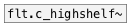

[< reference home](ceammc_lib.html)
---

# flt.highshelf~


gain boost|cut above some frequency

---

<br>


---


```


[noise~]   [F]         [F]
|          |           |
|          [@freq $1(  [@gain $1(
|          |           |
|          |           |
|          |           |
[flt.highshelf~ 3000 -15]
|
[ui.gain~ @size 120 14] [ui.dsp~]
|\
[dac~]

            
```

---
arguments:

freq(Hz): starting
            frequency for the shelf<br>
gain(db): amount
            of boost or cut apply to the signal<br>

---
properties:

@freq(Hz): starting frequency for the shelf<br>
@gain(db): amount of boost or cut apply to the signal<br>
@active: on/off dsp
            processing<br>

---
see also:<br>
[](flt.lowshelf~.html)
[](flt.c_highshelf~.html)
