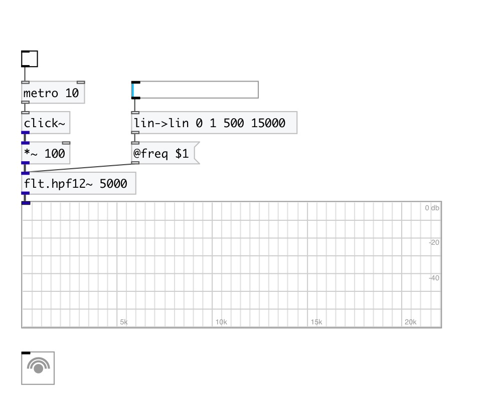
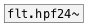

[< reference home](index.html)
---

# flt.hpf12~

High-pass second order Butterworth filter

---

A high-pass filter is an electronic filter that passes signals with a frequency
            higher than a certain cutoff frequency and attenuates signals with frequencies lower
            than the cutoff frequency.
Butterworth filter is a type of filter designed to have a frequency response as
            flat as possible in the passband.
 

---

---
arguments:

freq(Hz): cutoff
            frequency 

---
properties:

@freq(Hz): cutoff frequency 
@active: on/off dsp
            processing 

---
see also: 

