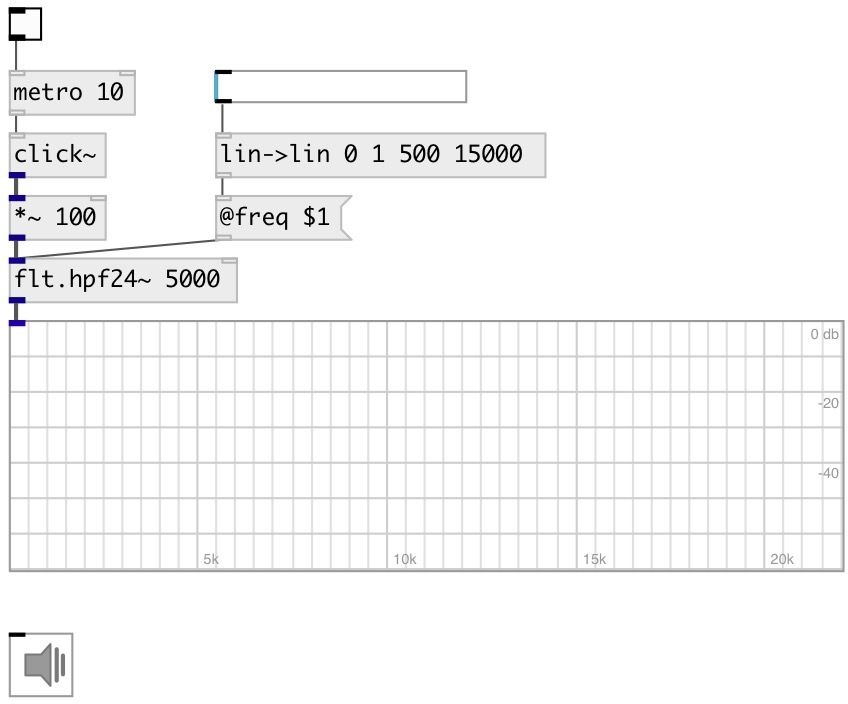

[index](index.html) :: [flt](category_flt.html)
---

# flt.hpf24~

###### High-pass fourth order Butterworth filter

*available since version:* 0.1

---

## information
A high-pass filter is an electronic filter that passes signals with a frequency
            higher than a certain cutoff frequency and attenuates signals with frequencies lower
            than the cutoff frequency.
Butterworth filter is a type of filter designed to have a frequency response as
            flat as possible in the passband.

## arguments:

* **freq**
cutoff frequency 
_type:_ float 
_units:_ Hz 

## properties:

* **@freq** 
Get/set cutoff frequency 
_type:_ float 
_units:_ Hz 
_range:_ 20..20000 
_default:_ 10000 

* **@active** 
Get/set on/off dsp processing 
_type:_ int 
_enum:_ 0, 1 
_default:_ 1 

## inlets:

* input signal 
_type:_ audio

## outlets:

* filtered signal 
_type:_ audio

## keywords:

[filter](keywords/filter.html)
[highpass](keywords/highpass.html)

**See also:**
[\[flt.hpf12~\]](flt.hpf12~.html)
[\[flt.lpf12~\]](flt.lpf12~.html)
[\[flt.c_hpf~\]](flt.c_hpf~.html)

**Authors:** Alex Nadzharov, Serge Poltavsky

**License:** GPL3 or later

