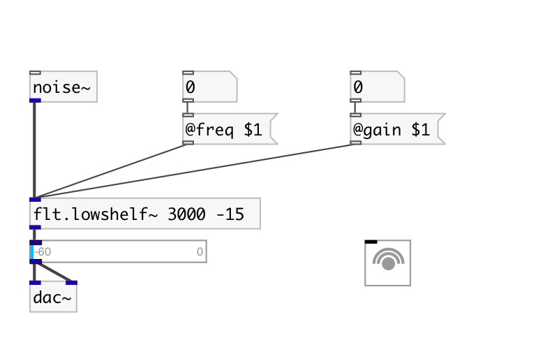

[< reference home](index.html)
---

# flt.lowshelf~

gain boost|cut below some frequency

---

 

---

---
arguments:

freq(Hz): corner
            frequency for the shelf 
gain(db): amount
            of boost or cut apply to the signal 

---
properties:

@freq(Hz): corner frequency for the shelf 
@gain(db): amount of boost or cut apply to the signal 
@active: on/off dsp
            processing 

---
see also: 

