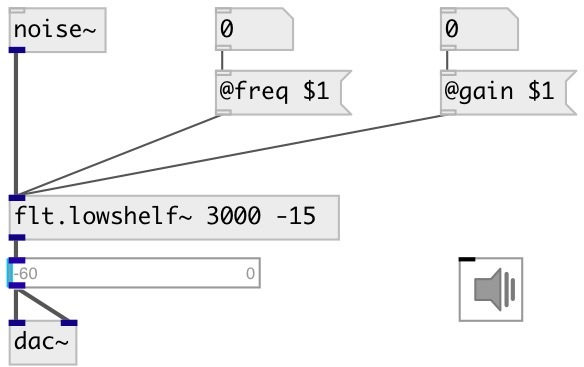

[index](index.html) :: [flt](category_flt.html)
---

# flt.lowshelf~

###### gain boost|cut below some frequency

*available since version:* 0.1

---

## arguments:

* **freq**
corner frequency for the shelf 
__type:__ float 
__units:__ Hz 

* **gain**
amount of boost or cut apply to the signal 
__type:__ float 
__units:__ db 

## properties:

* **@freq** 
Get/set corner frequency for the shelf 
__type:__ float 
__units:__ Hz 
__range:__ 20..20000 
__default:__ 1000 

* **@gain** 
Get/set amount of boost or cut apply to the signal 
__type:__ float 
__units:__ db 
__range:__ -15..15 
__default:__ 0 

* **@active** 
Get/set on/off dsp processing 
__type:__ int 
__enum:__ 0, 1 
__default:__ 1 

## inlets:

* input signal 
__type:__ audio 

## outlets:

* filtered signal
__type:__ audio 

## keywords:

[filter](keywords/filter.html)
[lowshelf](keywords/lowshelf.html)

**See also:**
[\[flt.highshelf~\]](flt.highshelf~.html)
[\[flt.c_lowshelf~\]](flt.c_lowshelf~.html)

**Authors:** Alex Nadzharov, Serge Poltavsky

**License:** GPL3 or later

