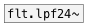
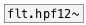
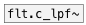

[<<< reference home](ceammc_lib.md)
---

# flt.lpf12~

```


[T]
|
[metro 10] [ui.hsl]
|          |
[click~]   [lin->lin 0 1 500 15000]
|          |
[*~ 100]   [@freq $1(
|          |
[flt.lpf12~ 5000]
|
[ui.spectroscope~ @size=400x120]


[ui.dsp~]

            
```
---
Low-pass second order Butterworth filter
---
arguments:

freq(Hz): cutoff
            frequency<br>

---
properties:

@freq(Hz): cutoff frequency<br>
@active: on/off dsp
            processing<br>

---
see also:<br>
[](flt.lpf24~.md)
[](flt.hpf12~.md)
[](flt.c_lpf~.md)
