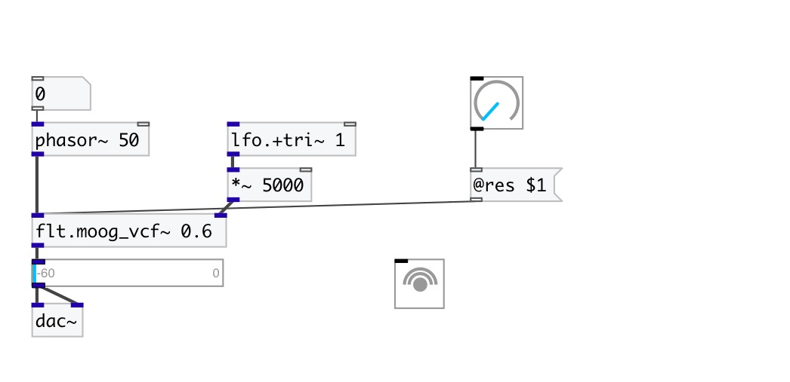

[< reference home](index.html)
---

# flt.moog_vcf~

Moog Voltage Controlled Filter

---

 

---

---
arguments:

res: normalized amount of
            corner-resonance 

---
properties:

@res: normalized
            amount of corner-resonance 
@active: on/off dsp
            processing 

