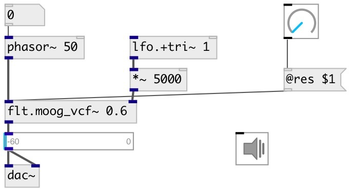

[index](index.html) :: [flt](category_flt.html)
---

# flt.moog_vcf~

###### Moog Voltage Controlled Filter

*available since version:* 0.6

---

## arguments:

* **RES**
normalized amount of corner-resonance 
_type:_ float 

## methods:

* **reset**
reset object state 

## properties:

* **@res** 
Get/set normalized amount of corner-resonance 
_type:_ float 
_range:_ 0..1 
_default:_ 0.4 

* **@active** 
Get/set on/off dsp processing 
_type:_ bool 
_default:_ 1 

## inlets:

* input signal 
_type:_ audio
* filter center frequency in Hz 
_type:_ audio

## outlets:

* filtered signal 
_type:_ audio

## keywords:

[moog](keywords/moog.html)
[vcf](keywords/vcf.html)

**Authors:** Serge Poltavsky

**License:** GPL3 or later

