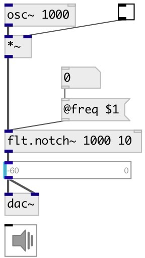

[index](index.html) :: [flt](category_flt.html)
---

# flt.notch~

###### band-rejection filter

*available since version:* 0.1

---

## information
filter that passes most frequencies unaltered, but attenuates those in a specific range to very low levels. It is the opposite of a band-pass filter.

## arguments:

* **FREQ**
center frequency 
_type:_ float 
_units:_ Hz 

* **WIDTH**
band width (approximate) 
_type:_ float 
_units:_ Hz 

## properties:

* **@freq** 
Get/set center frequency 
_type:_ float 
_units:_ Hz 
_range:_ 20..20000 
_default:_ 1000 

* **@width** 
Get/set band width (approximate) 
_type:_ float 
_units:_ Hz 
_range:_ 1..10000 
_default:_ 50 

* **@active** 
Get/set on/off dsp processing 
_type:_ bool 
_default:_ 1 

* **@osc** (initonly)
Get/set OSC server name to listen 
_type:_ symbol 

* **@id** (initonly)
Get/set OSC address id. If specified, bind all properties to /ID/flt_notch/PROP_NAME
osc address, if empty bind to /flt_notch/PROP_NAME. 
_type:_ symbol 

## inlets:

* input signal 
_type:_ audio
* set frequency 
_type:_ control

## outlets:

* filtered signal 
_type:_ audio

## keywords:

[filter](keywords/filter.html)
[lowshelf](keywords/lowshelf.html)

**See also:**
[\[flt.bpf12~\]](flt.bpf12~.html)

**Authors:** Serge Poltavsky

**License:** GPL3 or later

