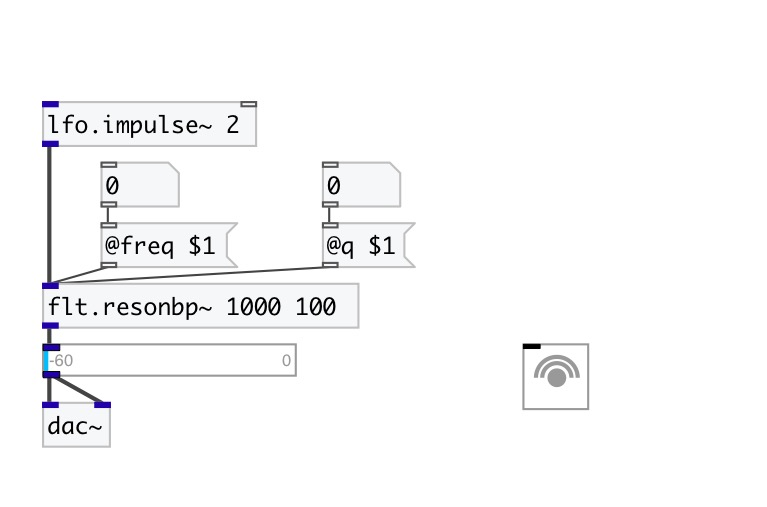

[< reference home](index.html)
---

# flt.resonbp~

Simple resonant bandpass filter

---

 

---

---
arguments:

freq(Hz): center
            frequency 
q: Q 

---
properties:

@freq(Hz): center frequency 
@q: 
            Q 
@active: on/off dsp
            processing 

---
see also: 

