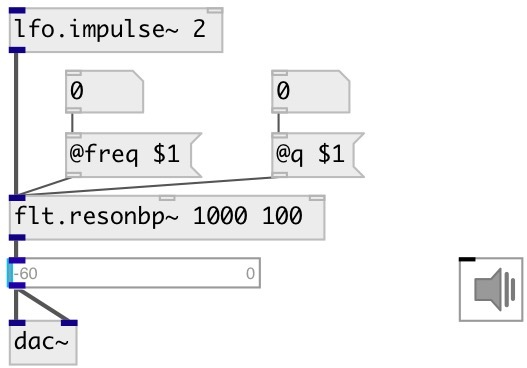

[index](index.html) :: [flt](category_flt.html)
---

# flt.resonbp~

###### Simple resonant bandpass filter

*available since version:* 0.1

---

## arguments:

* **freq**
center frequency 
_type:_ float 
_units:_ Hz 

* **q**
Q 
_type:_ float 

## properties:

* **@freq** 
Get/set center frequency 
_type:_ float 
_units:_ Hz 
_range:_ 20..20000 
_default:_ 1000 

* **@q** 
Get/set Q 
_type:_ float 
_range:_ 0.1..300 
_default:_ 80 

* **@active** 
Get/set on/off dsp processing 
_type:_ int 
_enum:_ 0, 1 
_default:_ 1 

## inlets:

* input signal 
_type:_ audio

## outlets:

* filtered signal 
_type:_ audio

## keywords:

[filter](keywords/filter.html)
[resonant](keywords/resonant.html)

**See also:**
[\[flt.bpf12~\]](flt.bpf12~.html)

**Authors:** Serge Poltavsky

**License:** GPL3 or later

