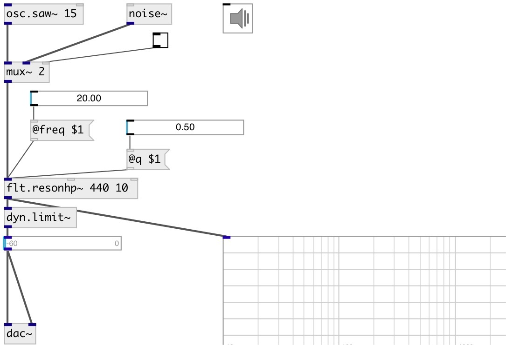

[index](index.html) :: [flt](category_flt.html)
---

# flt.resonhp~

###### Simple resonant highpass filter

*available since version:* 0.9.6

---

## arguments:

* **FREQ**
center frequency 
_type:_ float 
_units:_ Hz 

* **Q**
Quality factor 
_type:_ float 

## properties:

* **@freq** 
Get/set center frequency 
_type:_ float 
_units:_ Hz 
_range:_ 20..20000 
_default:_ 100 

* **@q** 
Get/set Quality factor 
_type:_ float 
_range:_ 0.1..100 
_default:_ 20 

* **@active** 
Get/set on/off dsp processing 
_type:_ bool 
_default:_ 1 

* **@osc** (initonly)
Get/set OSC server name to listen 
_type:_ symbol 

* **@id** (initonly)
Get/set OSC address id. If specified, bind all properties to /ID/flt_resonhp/PROP_NAME
osc address, if empty bind to /flt_resonhp/PROP_NAME. 
_type:_ symbol 

## inlets:

* input signal 
_type:_ audio
* set frequency 
_type:_ control
* set Q-factor 
_type:_ control

## outlets:

* filtered signal 
_type:_ audio

## keywords:

[filter](keywords/filter.html)
[resonant](keywords/resonant.html)
[highpass](keywords/highpass.html)

**See also:**
[\[flt.resonbp~\]](flt.resonbp~.html)
[\[flt.resonlp~\]](flt.resonlp~.html)

**Authors:** Serge Poltavsky

**License:** GPL3 or later

