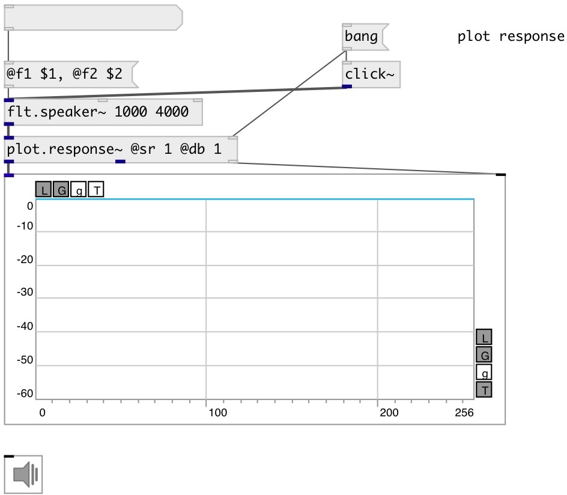

[index](index.html) :: [flt](category_flt.html)
---

# flt.speaker~

###### speaker emulation band-pass filter

*available since version:* 0.9.7

---

## information
Low-frequency speaker model = +12 dB/octave slope breaking to flat near @f1. Implemented using two dc blockers in series. High-frequency model = -24 dB/octave slope implemented using a fourth-order Butterworth lowpass.

## arguments:

* **F1**
lower band frequency 
_type:_ float 
_units:_ Hz 

* **F2**
high band frequency 
_type:_ float 
_units:_ Hz 

## methods:

* **reset**
reset filter state 

## properties:

* **@f1** 
Get/set lower band frequency 
_type:_ float 
_units:_ Hz 
_range:_ 20..1000 
_default:_ 130 

* **@f2** 
Get/set high band frequency 
_type:_ float 
_units:_ Hz 
_range:_ 1000..20000 
_default:_ 5000 

* **@gain** 
Get/set filter gain 
_type:_ float 
_units:_ db 
_range:_ -30..30 
_default:_ 0 

* **@drywet** 
Get/set proportion of mix between the original (dry) and &#39;effected&#39; (wet) signals. 0 -
dry signal, 1 - wet 
_type:_ float 
_range:_ 0..1 
_default:_ 1 

* **@bypass** 
Get/set bypass flag. If true: bypass &#39;effected&#39; signal. 
_type:_ bool 
_default:_ 0 

* **@osc** (initonly)
Get/set OSC server name to listen 
_type:_ symbol 

* **@id** (initonly)
Get/set OSC address id. If specified, bind all properties to /ID/flt_speaker/PROP_NAME
osc address, if empty bind to /flt_speaker/PROP_NAME. 
_type:_ symbol 

* **@active** 
Get/set on/off dsp processing 
_type:_ bool 
_default:_ 1 

## inlets:

* input signal 
_type:_ audio
* set @f1 property 
_type:_ control
* set @f2 property 
_type:_ control

## outlets:

* filtered signal 
_type:_ audio

## keywords:

[filter](keywords/filter.html)
[speaker](keywords/speaker.html)
[bandpass](keywords/bandpass.html)
[bpf](keywords/bpf.html)

**See also:**
[\[flt.bpf24~\]](flt.bpf24~.html)

**Authors:** Serge Poltavsky

**License:** GPL3 or later

