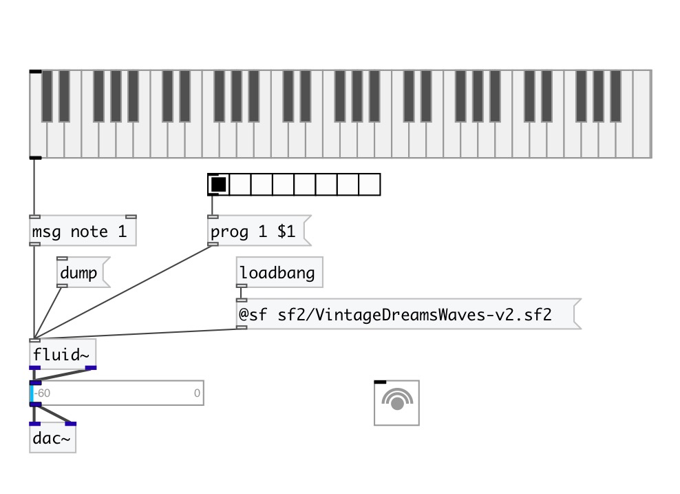

[< reference home](index.html)
---

# fluid~

FluidSynth SoundFont 2 player

---

 

---

---
arguments:

---
properties:

@sf: path to SoundFont 
@version: FluidSynth
            version 
@soundfonts: list of found
            soundfonts 

