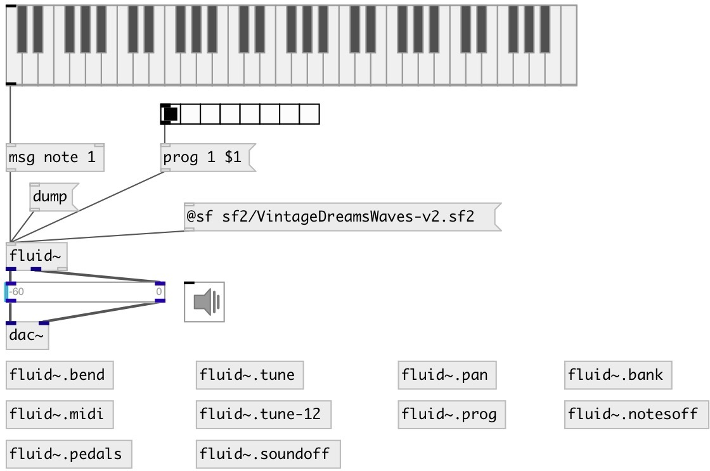

[index](index.html) :: [misc](category_misc.html)
---

# fluid~
**aliases:** [ceammc/fluid\~]

###### FluidSynth SoundFont 2 player

*available since version:* 0.6

---

## information
If no soundfont specified: default soundfont is loaded It is WaveSine.sf2, simple sine synth

## arguments:

* **SF**
soundfont path 
_type:_ symbol 

## methods:

* **aftertouch**
aftertouch channel pressure 
  __parameters:__
  - **[CHAN=0]** MIDI channel, ignored 
    type: int  

  - **VEL** MIDI velocity 
    type: int  
    required: True  

* **bank**
select instrument bank number on a MIDI channel, but doesn&#39;t change instrument,
it should be done with after that with *prog* message. 
  __parameters:__
  - **[CHAN=0]** MIDI channel, if zero or ommited set for all channels 
    type: int  

  - **BANK** instrument bank number 
    type: int  
    required: True  

* **bend**
pitchband change 
  __parameters:__
  - **[CHAN=0]** MIDI channel, if zero or ommited set for all channels 
    type: int  

  - **VALUE** value in 0..0x3fff range, with 0x2000 center. 
    type: int  
    required: True  

* **bend:f**
pitchband change 
  __parameters:__
  - **[CHAN=0]** MIDI channel, if zero or ommited set for all channels 
    type: int  

  - **VALUE** value in -1..+1 range, with 0 center. 
    type: float  
    required: True  

* **bend:i**
pitchband change 
  __parameters:__
  - **[CHAN=0]** MIDI channel, if zero or ommited set for all channels 
    type: int  

  - **VALUE** value in -0x2000..0x1fff range, with 0 center. 
    type: int  
    required: True  

* **bendsens**
set pitchbend sensitivity 
  __parameters:__
  - **[CHAN=0]** MIDI channel, if zero or ommited set for all channels 
    type: int  

  - **RANGE** semitones sensitivity 
    type: int  
    units: semitone  
    required: True  

* **cc**
control change 
  __parameters:__
  - **[CHAN=0]** MIDI channel, if zero or ommited set on all channel 
    type: int  

  - **CC** MIDI control number 
    type: int  
    required: True  

  - **VAL** MIDI control value 
    type: int  
    required: True  

* **gen**
set a SoundFont generator (effect) value on a MIDI channel in real-time
(CHANNEL, PARAM, VALUE or PARAM, VALUE expected) 

* **hold**
hold (sustain, right) pedal, ignore note release when active, release all notes
when set to off. 
  __parameters:__
  - **CHAN=0** MIDI channel, if zero or ommited sustain all channels 
    type: int  
    required: True  

  - **VAL** pedal state 
    type: int  
    required: True  

* **legato**
enable or disable legato/smooth transitions between consecutive notes 
  __parameters:__
  - **CHAN** MIDI channel, if zero or ommited apply to all channels 
    type: int  
    required: True  

  - **VAL** pedal state 
    type: int  
    required: True  

* **midi**
send raw midi message to synth 
  __parameters:__
  - **BYTES** list of bytes 
    type: list  
    required: True  

* **note**
play note 
  __parameters:__
  - **[CHAN=0]** MIDI channel, if zero or ommited play on first(!) channel 
    type: int  

  - **NOTE** MIDI note 
    type: int  
    required: True  

  - **VEL** MIDI velocity 
    type: int  
    required: True  

* **notes_off**
turn off all notes on a MIDI channel (put them into release phase) 
  __parameters:__
  - **[CHAN=0]** MIDI channel, if zero or not specified turn notes on all channels 
    type: int  

* **pan**
set channel panning 
  __parameters:__
  - **[CHAN=0]** MIDI channel, if zero or ommited set for all channels 
    type: int  

  - **PAN** pan value, 0: left, 8192(0x2000): center, 16383(0x3fff): right 
    type: float  
    required: True  

* **pan:f**
set channel panning 
  __parameters:__
  - **[CHAN=0]** MIDI channel, if zero or ommited set for all channels 
    type: int  

  - **PAN** pan value, -1: left, 0: center, 1): right 
    type: float  
    required: True  

* **pan:i**
set channel panning 
  __parameters:__
  - **[CHAN=0]** MIDI channel, if zero or ommited set for all channels 
    type: int  

  - **PAN** pan value, -8192(-0x2000): left, 0: center, 8191(0x1fff): right 
    type: float  
    required: True  

* **panic**
send MIDI system reset command (big red &#39;panic&#39; button), turns off notes,
resets controllers and restores initial basic channel configuration 

* **polytouch**
polytouch key pressure 
  __parameters:__
  - **[CHAN=0]** MIDI channel, ignored 
    type: int  

  - **NOTE** MIDI note 
    type: int  
    required: True  

  - **VEL** MIDI velocity 
    type: int  
    required: True  

* **prog**
program change 
  __parameters:__
  - **[CHAN=0]** MIDI channel, if zero or ommited set for all channels 
    type: int  

  - **PGM** program number 
    type: int  
    required: True  

* **reset**
reset synth channels 
  __parameters:__
  - **[CHAN=0]** MIDI channel, if zero or not specified reset all channels 
    type: int  

* **soft**
soft (left) pedal, activate the soft strike effect 
  __parameters:__
  - **CHAN** MIDI channel, if zero or ommited apply to all channels 
    type: int  
    required: True  

  - **VAL** pedal state 
    type: int  
    required: True  

* **sostenuto**
sostenuto (middle) pedal, hold notes pressed before pedal activation, new notes
are passed untouched. Release holded notes when set to off 
  __parameters:__
  - **CHAN** MIDI channel, if zero or ommited apply to all channels 
    type: int  
    required: True  

  - **VAL** pedal state 
    type: int  
    required: True  

* **sound_off**
immediately stop all notes (skips release phase). 
  __parameters:__
  - **[CHAN=0]** MIDI channel, if zero or not specified stop notes on all channels 
    type: int  

* **sysex**
accept SYSEX message 
  __parameters:__
  - **BYTES** list of bytes 
    type: list  
    required: True  

* **tune.**
set fine tuninig in cents, see tune:s 

* **tune:12**
set and activate octave tuning program in cents deviations 
  __parameters:__
  - **BANK** tuning bank (not related to MIDI instrument bank) 
    type: int  
    required: True  

  - **PRESET** tuning preset (not related to MIDI instrument program) 
    type: int  
    required: True  

  - **TUNES** list of scale deviations from 12TET in cents 
    type: list  
    required: True  

* **tune:c**
set fine tuning in cents 
  __parameters:__
  - **[CHAN=0]** MIDI channel, if zero or not specified apply tuning to all channels 
    type: int  

  - **CENTS** cents (float) tuning 
    type: float  
    required: True  

* **tune:s**
set tuninig in semitones 
  __parameters:__
  - **[CHAN=0]** MIDI channel, if zero or not specified apply tuning to all channels 
    type: int  

  - **SEMI** semitones (float) tuning 
    type: float  
    required: True  

* **tunesel**
select tuning bank and preset 
  __parameters:__
  - **BANK** tuning bank (not related to MIDI instrument bank) 
    type: int  
    required: True  

  - **PRESET** tuning preset (not related to MIDI instrument program) 
    type: int  
    required: True  

## properties:

* **@sf** 
Get/set soundfont path, you can use **default** value to load default soundfont 
_type:_ symbol 

* **@version** (readonly)
Get FluidSynth version 
_type:_ symbol 
_default:_ 2.3.2 

* **@soundfonts** (readonly)
Get list of found soundfonts 
_type:_ list 

* **@gain** 
Get/set output gain 
_type:_ float 
_range:_ 0..10 
_default:_ 0 

* **@volume** 
Get/set output volume (same as @gain but in db) 
_type:_ float 
_units:_ db 
_range:_ -60..10 
_default:_ 0 

* **@reverb_level** 
Get/set reverberation level 
_type:_ float 
_default:_ 0 

* **@reverb_room** 
Get/set reverberation room size 
_type:_ float 
_default:_ 0 

* **@reverb_width** 
Get/set reverberation spread width 
_type:_ float 
_default:_ 0 

* **@reverb_damp** 
Get/set reverberation damp 
_type:_ float 
_default:_ 0 

* **@poly** 
Get/set max number of voices 
_type:_ float 
_range:_ 1..1024 
_default:_ 0 

* **@avoices** (readonly)
Get number midi channels 
_type:_ float 
_default:_ 0 

* **@n** (readonly)
Get number of active voices 
_type:_ int 
_default:_ 16 

* **@cpuload** (readonly)
Get current cpu load 
_type:_ float 
_default:_ 0 

* **@bufsize** (readonly)
Get internal buffer size 
_type:_ float 
_units:_ samp 
_default:_ 0 

## inlets:

* load mod file 
_type:_ control

## outlets:

* left channel and property output 
_type:_ audio
* right channel 
_type:_ audio
* int: number of active voices (output only on change) 
_type:_ control

## keywords:

[mod](keywords/mod.html)
[player](keywords/player.html)
[midi](keywords/midi.html)
[soundfont](keywords/soundfont.html)
[fluid](keywords/fluid.html)

**Authors:** Serge Poltavsky

**License:** GPL3 or later

