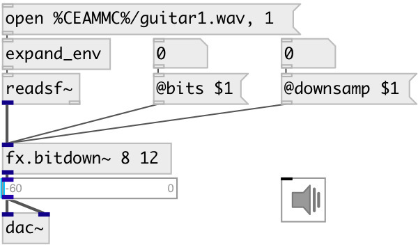

[index](index.html) :: [fx](category_fx.html)
---

# fx.bitdown~

###### bit downer and downsampler effect

*available since version:* 0.7

---

## arguments:

* **bits**
number of bits 
__type:__ int 

* **downsamp**
number of samples to skip 
__type:__ int 
__units:__ samp 

## properties:

* **@bits** 
Get/set output bits 
__type:__ int 
__range:__ 1..16 
__default:__ 16 

* **@downsamp** 
Get/set number samples to skip 
__type:__ int 
__units:__ samp 
__range:__ 1..200 
__default:__ 1 

* **@bypass** 
Get/set if set to 1 - bypass &#39;effected&#39; signal. 
__type:__ int 
__enum:__ 0, 1 
__default:__ 0 

* **@active** 
Get/set on/off dsp processing 
__type:__ int 
__enum:__ 0, 1 
__default:__ 1 

## inlets:

* left channel 
__type:__ audio 

## outlets:

* output
__type:__ audio 

## keywords:

[fx](keywords/fx.html)
[bits](keywords/bits.html)
[downsample](keywords/downsample.html)

**Authors:** Viacheslav Lotsmanov, Serge Poltavsky

**License:** GPL3 or later

