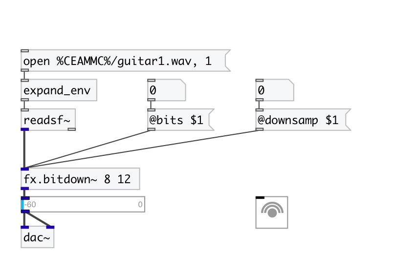

[< reference home](index.html)
---

# fx.bitdown~

bit downer and downsampler effect

---

 

---

---
arguments:

bits: number of bits 
downsamp(samp): number
            of samples to skip 

---
properties:

@bits: output
            bits 
@downsamp(samp): number samples to skip 
@bypass: if set to 1 - bypass
            &#39;effected&#39; signal. 
@active: on/off dsp
            processing 

