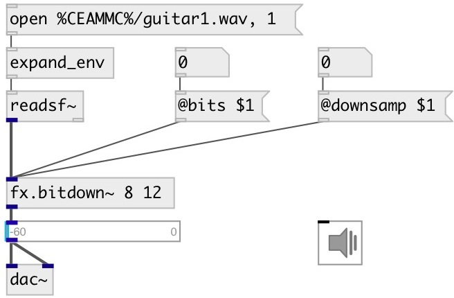

[index](index.html) :: [fx](category_fx.html)
---

# fx.bitdown~

###### bit downer and downsampler effect

*available since version:* 0.7

---

## arguments:

* **BITS**
number of bits 
_type:_ int 

* **DOWNSAMP**
number of samples to skip 
_type:_ int 
_units:_ samp 

## methods:

* **reset**
reset object 

## properties:

* **@bits** 
Get/set output bits 
_type:_ int 
_range:_ 1..16 
_default:_ 16 

* **@downsamp** 
Get/set number samples to skip 
_type:_ int 
_units:_ samp 
_range:_ 1..200 
_default:_ 1 

* **@bypass** 
Get/set bypass flag. If true: bypass &#39;effected&#39; signal. 
_type:_ bool 
_default:_ 0 

* **@active** 
Get/set on/off dsp processing 
_type:_ bool 
_default:_ 1 

* **@osc** (initonly)
Get/set OSC server name to listen 
_type:_ symbol 

* **@id** (initonly)
Get/set OSC address id. If specified, bind all properties to /ID/fx_bitdown/PROP_NAME
osc address, if empty bind to /fx_bitdown/PROP_NAME. 
_type:_ symbol 

## inlets:

* left channel 
_type:_ audio

## outlets:

* output 
_type:_ audio

## keywords:

[fx](keywords/fx.html)
[bits](keywords/bits.html)
[downsample](keywords/downsample.html)

**Authors:** Viacheslav Lotsmanov, Serge Poltavsky

**License:** GPL3 or later

