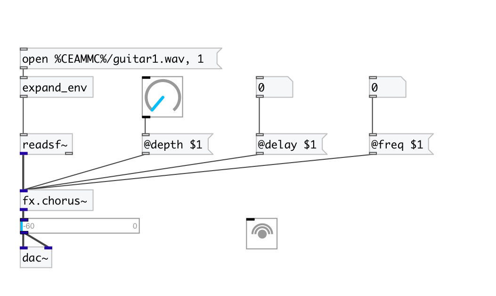

[< reference home](index.html)
---

# fx.chorus~

Chorus effect

---

 

---

---
arguments:

---
properties:

@delay(ms): delay amount 
@freq(Hz): effect freq 
@depth: effect
            depth 
@drywet: Ratio
            between processed signal (wet) and source signal 
@bypass: if set to 1 - bypass
            &#39;effected&#39; signal. 
@active: on/off dsp
            processing 

